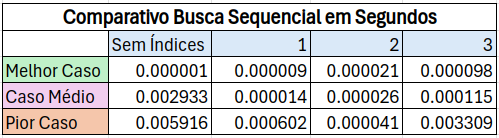

# Sistema de Busca Sequencial Indexada (ESDD)

## Introdução

Este projeto é parte do **Exercício Avaliativo** para a disciplina de Estruturas de Dados e Algoritmos. O objetivo é implementar um sistema de **Busca Sequencial Indexada** eficiente em um arquivo contendo 1 milhão de registros ordenados gerados aleatoriamente. O sistema utiliza uma (ou mais) **tabelas auxiliares de índices** para otimizar o processo de busca, reduzindo a quantidade de comparações necessárias.

## Funcionalidades do Sistema

1. **Geração de Dados**: Um conjunto de registros é gerado de forma aleatória e ordenada baseado sempre em uma **seed**, garantindo que o arquivo simule um cenário suficiente para buscas indexadas de forma reprodutível.
2. **Tabelas de Índices**: Criação de tabelas auxiliares que armazenam pontos de referência no arquivo, delimitando intervalos para a busca sequencial.
3. **Busca Sequencial Indexada**: Utiliza a tabela de índices para localizar rapidamente o intervalo correto e realiza uma busca sequencial somente dentro desse intervalo.
4. **Busca Sequencial sem Índices**: Busca sequencial normal para comparação.

## Estrutura do Projeto
O projeto é dividido em várias funções principais, implementadas em **C**. 

### Funções Principais Acessíveis.
- **`create_data_set`**: Gera o conjunto de dados ordenados, baseado na **seed** e **size**.
- **`sequential_search`**: Realiza a busca sequencial, retornando a **posição** ou **-1** caso não encontre.
- **`indexed_sequential_search`**: Coordena a busca sequencial indexada cirando e usando as tabelas de índices.

## Resultados de Performance 📊 
Abaixo estão os tempos médios de execução, comparando a busca sequencial tradicional com a busca sequencial indexada:

Os resultados mostram ganhos significativos de eficiência na maioria dos casos ao utilizar a tabela de índices, principalmente em cenarios de caso médio e pior caso. Porém também é possível observar que adicionar muitas tablas de índices, ou ter tamanhos de blocos pequenos demais, pode ter o efeito contrário, aumentando tempo de busca.

Outro ponto importante é que o no **melhor caso** e em casos muito próximos ao melhor caso, a busca sequêncial normal vai ser sempre superior.

## Possíveis Melhorias
- **Melhorar fórmula para encontrar intervalos**: Apesar de 10% ser um bom número na maioria dos casos testados, talvez exista uma melhor fórmula ou maneira de determinar o tamanho dos blocos (intervalos) de forma dinâmica.
- **Criar fórumla para definir quantidade de Tabelas de Índice dinamicamente**: Com 1 Milhão de números o "sweet spot" para tabelas índices foi por volta de 2. Porém para outros datasets isso já não é verdade. Uma fórmula para determinar essa quatidade baseada no tamanho do dataset poderia ser útil. 
 

## Artefato Requerido para entrega
- **Vídeo**: https://www.youtube.com/watch?v=Gen761hwbps